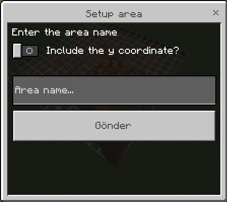

# WorldGuardian
Designed for Pocketmine world, area guard plugin

# Config
```yaml
locked-world-settings:
  active: true #active is message
  message: "§c> This world is locked" #message content
```


